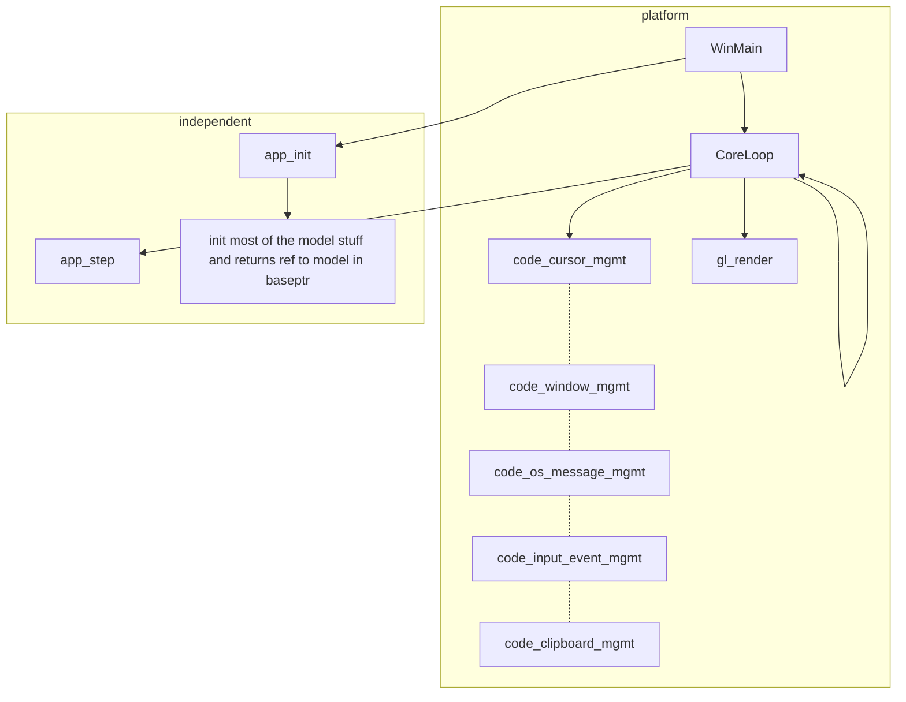
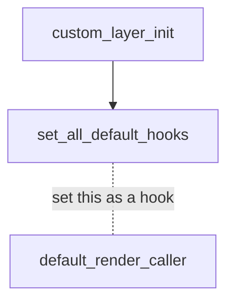
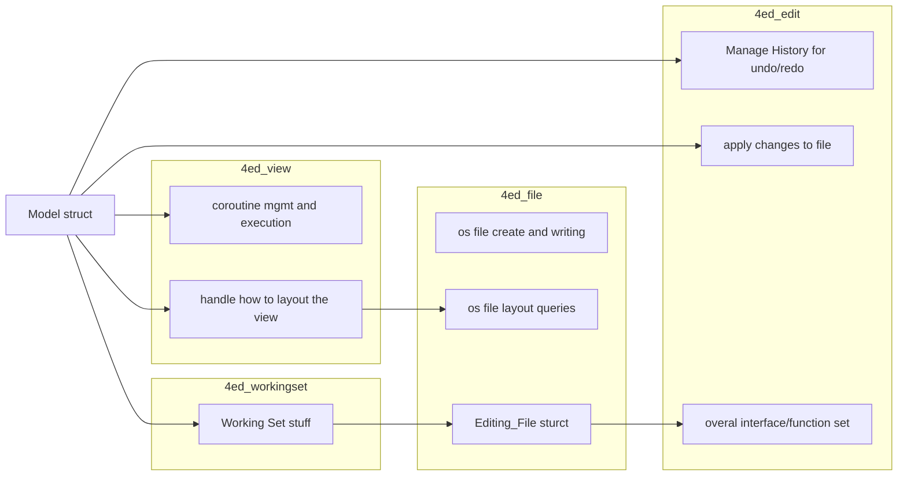
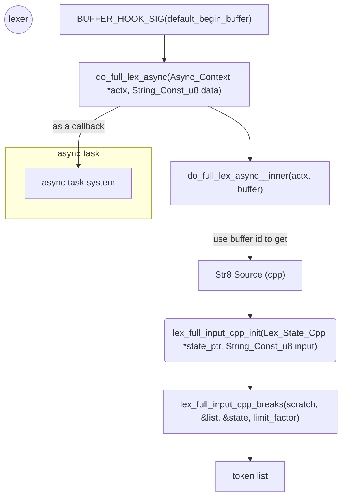
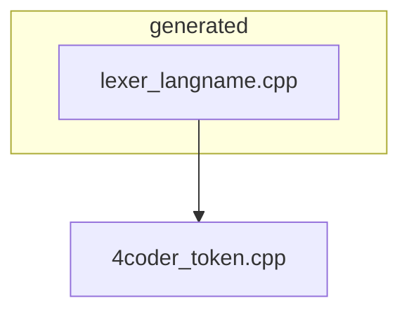
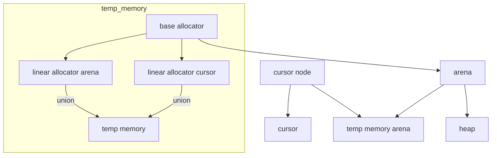

# Custom Layer

## Basics

`win32_4ed.cpp` runs a sequence of code before the  **main application loop** to load the custom layer `DLL` . That dll has a function to get a **VTable** defined by the custom layer code and pass to the main application. The main application will make use of those functions referenced in the **VTable** for their altered behavior.

```c
// located in: 4ed.h
struct App_Functions{
    App_Load_VTables *load_vtables;
    App_Get_Logger *get_logger;
    App_Read_Command_Line *read_command_line;
    App_Init *init;
    App_Step *step;
};
```

If  the custom layer dll successfully loaded and the custom layer init proc is found then the function pointer to init the custom layer is passed into function called `app_init`. To search for the **definition** search `App_Init_Sig(app_init)`

is passed in the 

```c
#define App_Init_Sig(name) \
    void name(Thread_Context *tctx,     \
    Render_Target *target,    \
    void *base_ptr,           \
    String_Const_u8 current_directory,\
    Custom_API api)
```

The `custom_api.h` file is a generated header file that defines `App_Init` so that it can used by the custom layer code and is included in the custom layer **dll** compilation. In the main application the actual name of the function that fills out the `VTable` and calls the custome layer init file is called `app_init`.

```c
// found in: 4ed.cpp
App_Init_Sig(app_init){
  Models *models = (Models*)base_ptr;
  models->keep_playing = true;
  models->hard_exit = false;
  // ... omitted section 
  // ...
  API_VTable_custom custom_vtable = {};
  custom_api_fill_vtable(&custom_vtable);
  API_VTable_system system_vtable = {};
  system_api_fill_vtable(&system_vtable);
  Custom_Layer_Init_Type *custom_init = api.init_apis(&custom_vtable, &system_vtable);
  Assert(custom_init != 0);
  //... omitted section
  //...
```

The `custom_api_fill_vtable(API_VTable_custom *vtable)` call assigns the funtion pointers with the addresses of functions that are defined by the main application(4coder core).  This is essentially defines 4coder default behavior.

Then the VTable is passed to `api.init_apis(&custom_vtable, &system_vtable)` which has the following implementation.

```c
// found in: 4coder_custom.cpp
init_apis(API_VTable_custom *custom_vtable, API_VTable_system *system_vtable){
    custom_api_read_vtable(custom_vtable);
    system_api_read_vtable(system_vtable);
    return(custom_layer_init);
}
```

The `custom_api_read_vtable(custom_vtable);` call fills out a **set** of global function pointers that are referenced by the 4coder custom layer. It uses the values of the VTable that was passed in by the main application(4coder core) to make sure that the custom code can make use of the 4coder's default behavior. The **set** of function pointers that exist in the VTable and **globally** are essentially what make up the interface of the  **4coder API**.

The `system_api_read_vtable(system_vtable);` does the reverse of filling out the VTable with the **custom layer global function pointers**. This essentially doesn't do anything except give the **custom layer** a point in the code to **override the function pointer** so that it is pointing to a **custom layer defined function** rather than the function originally defined by the main application(4coder core).  

# Core Flow

The core functionality of 4coder is defined by the following functions `app_init`and `app_sig`.
They have the following signitures

```c
#define App_Init_Sig(name) \
void name(Thread_Context *tctx,     \
Render_Target *target,    \
void *base_ptr,           \
String_Const_u8 current_directory,\
Custom_API api)

#define App_Step_Sig(name) Application_Step_Result \
name(Thread_Context *tctx,                 \
Render_Target *target,                \
void *base_ptr,                       \
Application_Step_Input *input)
```

Each step takes the following information

```c
struct Application_Step_Input{
    b32 first_step;
    f32 dt;
    Mouse_State mouse;
    Input_List events;
    String_Const_u8 clipboard;
    b32 trying_to_kill;
};
```



## Hooks

## Custom Commands

Custom commands are definded using the signiture
`void name(struct Application_Links *app)`

where   `Application_Links` just has a **thread context** and a generic pointer for a **command context**. 

```c
// found in: 4coder_types.h
api(custom)
struct Application_Links{
    Thread_Context *tctx;
    void *cmd_context;
};
```

The **command context** is just a void pointer that gets casted to a `Models` type in the `set_custom_hook` implementation.

```c
// found in: 4ed_api_implementations.cpp
api(custom) function void
set_custom_hook(Application_Links *app, Hook_ID hook_id, Void_Func *func_ptr){
    Models *models = (Models*)app->cmd_context;
    switch (hook_id){
        case HookID_BufferViewerUpdate:
        {
            models->buffer_viewer_update = (Hook_Function*)func_ptr;
        }break;
        case HookID_DeltaRule:
        {
            models->delta_rule = (Delta_Rule_Function*)func_ptr;
        }break;
```

The struct `API_VTable_custom` contains the **set** of function pointers of the **4coder API**.  

Examples of setting up hooks can be found in `4coder_default_hooks.cpp`

```c
// found in: 4coder_default_hooks.cpp
internal void
set_all_default_hooks(Application_Links *app){
  set_custom_hook(app, HookID_BufferViewerUpdate, default_view_adjust);

  set_custom_hook(app, HookID_ViewEventHandler, default_view_input_handler);
  set_custom_hook(app, HookID_Tick, default_tick);
```

In the Vtable are function for handling custom commands such as

```c
// found in: custom_api_master_list.h
// a function prototype for the set_custom_hook function
api(custom) function void set_custom_hook(Application_Links* app, Hook_ID hook_id, Void_Func* func_ptr);


// found in: custom_api.h
// type definition of a pointer to a function like custom_set_custom_hook
typedef void custom_set_custom_hook_type(Application_Links* app, Hook_ID hook_id, Void_Func* func_ptr);

// function pointer member in API_VTable_custom
custom_set_custom_hook_type *set_custom_hook;

// a forward decleration to the function set_custom_hook
internal void set_custom_hook(Application_Links* app, Hook_ID hook_id, Void_Func* func_ptr);

// a global fucntion pointer to a 'custom_set_custom_hook' function
global custom_set_custom_hook_type *set_custom_hook = 0;
```

This function takes in a void function pointer.

```c
#define HOOK_SIG(name) i32 name(Application_Links *app)
#define BUFFER_HOOK_SIG(name) i32 name(Application_Links *app, Buffer_ID buffer_id)
```

```c
// found in: 4coder_types.h
typedef i32 Hook_ID;
enum{
    HookID_Tick,
    HookID_RenderCaller,
    HookID_WholeScreenRenderCaller,
    HookID_DeltaRule,
    HookID_BufferViewerUpdate,
    HookID_ViewEventHandler,
    HookID_BufferNameResolver,
    HookID_BeginBuffer,
    HookID_EndBuffer,
    HookID_NewFile,
    HookID_SaveFile,
    HookID_BufferEditRange,
    HookID_BufferRegion,
    HookID_Layout,
    HookID_ViewChangeBuffer,
};
```

## Languages

The `default_begin_buffer` function defines how a buffer will be process while it is open and visable in the editor. This function is passed a `buffer id`  and that is used to get the extension which will be used to determined how the texted should be layed out and if lexer for a programming language should be used.
The `buffer_set_layout(app, buffer_id, layout_virt_indent_literal_generic);` function is called when the **.cpp, .h, .c, ect...** extensions are called however I believe this function is tailored to `c` and `c++` syntax.

```c
// found in: 4coder_default_hooks.cpp
BUFFER_HOOK_SIG(default_begin_buffer){
  ProfileScope(app, "begin buffer");

  Scratch_Block scratch(app);

  b32 treat_as_code = false;
  String_Const_u8 file_name = push_buffer_file_name(app, scratch, buffer_id);
  if (file_name.size > 0){
    String_Const_u8 treat_as_code_string = def_get_config_string(scratch, vars_save_string_lit("treat_as_code"));
    String_Const_u8_Array extensions = parse_extension_line_to_extension_list(app, scratch, treat_as_code_string);
    String_Const_u8 ext = string_file_extension(file_name);
    for (i32 i = 0; i < extensions.count; ++i){
      if (string_match(ext, extensions.strings[i])){

        if (string_match(ext, string_u8_litexpr("cpp")) ||
            string_match(ext, string_u8_litexpr("h")) ||
            string_match(ext, string_u8_litexpr("c")) ||
            string_match(ext, string_u8_litexpr("hpp")) ||
            string_match(ext, string_u8_litexpr("cc"))){
          treat_as_code = true;
        //... ommitted section
        //...
#if 0 // not compiled in
        if (string_match(ext, string_u8_litexpr("cs"))){
          if (parse_context_language_cs == 0){
            init_language_cs(app);
          }
          parse_context_id = parse_context_language_cs;
        }

        if (string_match(ext, string_u8_litexpr("java"))){
          if (parse_context_language_java == 0){
            init_language_java(app);
          }
          parse_context_id = parse_context_language_java;
        }
        //...
#endif
    }
    //...
    if (treat_as_code){
      buffer_set_layout(app, buffer_id, layout_virt_indent_literal_generic);
    }
    else{
      buffer_set_layout(app, buffer_id, layout_generic);
    }
    //...
    return
}
```

The `Model` struct contains references to most of the essential pieces of infomation and functionality used by 4coder. This include references to some of the **hook**able functions. 

```c
struct Models{
    Arena arena_;
    Arena *arena;
    Heap heap;

    App_Settings settings;
    App_State state;

    Face_ID global_face_id;

    Coroutine_Group coroutines;
    Model_Wind_Down_Co *wind_down_stack;
    Model_Wind_Down_Co *free_wind_downs;

    Child_Process_Container child_processes;
    Custom_API config_api;

    Tick_Function *tick;
    Render_Caller_Function *render_caller;
    Whole_Screen_Render_Caller_Function *whole_screen_render_caller;
    Delta_Rule_Function *delta_rule;
    u64 delta_rule_memory_size;

    Hook_Function *buffer_viewer_update;
    Custom_Command_Function *view_event_handler;
    Buffer_Name_Resolver_Function *buffer_name_resolver;
    Buffer_Hook_Function *begin_buffer;
    Buffer_Hook_Function *end_buffer;
    Buffer_Hook_Function *new_file;
    Buffer_Hook_Function *save_file;
    Buffer_Edit_Range_Function *buffer_edit_range;
    Buffer_Region_Function *buffer_region;
    Layout_Function *layout_func;
    View_Change_Buffer_Function *view_change_buffer;
```

# Drawing Multi Colored Lines

Essentially done by queuing up string segments using a **linked list**. Each list **node** consist of a **string view**, a **color**, a **font id**, and **pointers**. The **list** also have **string view**, a **color**, a **font id** members which may serve as default for the child **nodes**.

The **linked list type** is called `Fancy_Line`. The **node type** is called `Fancy_String`.

`Fancy_Blocks` are used to chain up lines.

```c
push_fancy_string();
draw_fancy_line();
draw_fancy_string__inner();
draw_string_oriented();
font_set_face_from_id();
font_string_width();
draw_string();
translating_fully_process_byte();
font_get_glyph_advance();
draw_font_glyph();
draw_font_glyph();
draw__set_face_id();
codepoint_index_map_read();
draw__write_vertices_in_current_group();
draw__begin_new_group();
```

# # Drawing Various Stuff



# # Models Layer

The **main** struct for this **layer** is the `Models` struct. It contains the following pieces of infromation.

- An **allocator** in the form of an `Arena`

- A **settings** struct, `App_Settings`

- An **app state** struct, `App_State`

- A **32bit** id referncing a **Font Face**

- A **coroutine** related struct

- A struct for managing **child processes**, `Child_Process_Container`

- A **V Table** for the `Custom_API`

- Some **function pointers** for rendering. For general rendering and rendering the whole screen.

- A set of  **functions pointers** for managing buffers on *creation* and *destruction* and *layout* and *view management*

- A **color table** associated with the model

- ... and more shit
  
  - The `Models` struct is predominantely used by **view** oriented functions found in `4ed_view.cpp` . It is also referenced in **file** oriented code in   `4ed_file.cpp` and **editing/file editing** oriented code.

It seems to exist so that the app can follow the **MVC**  model view controller pattern.

The creation of a `Model` is a bit complex. It starts off with a pointer in `WinMain` called **base_ptr** and is passed into various 4coder core functions like 



# Rendering

`Render_Target`

`Render_Group`

`Render_Vertex_List`
`Render_Vertex_Array_Node`
`Render_Vertex`

# Coroutines

Heavily used in **4coder**'s `views` and `api implementations`.

### Implementation

```c
typedef u32 Coroutine_State;
enum{
    CoroutineState_Dead,
    CoroutineState_Active,
    CoroutineState_Inactive,
    CoroutineState_Waiting,
};
typedef u32 Coroutine_Type;
enum{
    CoroutineType_Uninitialized,
    CoroutineType_Root,
    CoroutineType_Sub,
};
struct Coroutine{
    Coroutine *next;
    Thread_Context *tctx;
    void *in;
    void *out;
    System_Thread thread;
    System_Condition_Variable cv;
    struct Coroutine_Group *sys;
    Coroutine_Function *func;
    Coroutine *yield_ctx;
    Coroutine_State state;
    Coroutine_Type type;
    void *user_data;
};
struct Coroutine_Group{
    Arena arena;
    System_Mutex lock;
    System_Condition_Variable init_cv;
    b32 did_init;
    Coroutine *active;
    Coroutine *unused;
    Coroutine root;
};
```


The `Coroutine` struct seems to be a management struct for a system to orchestrate it's coroutine based operations. But above that is the `Coroutine_Group` struct which seems to track active and  unused coroutine structs and possibly even provides structs from it's allocator.

API:
```c
typedef void Coroutine_Function(struct Coroutine *head);

// ???
coroutine__pass_control
coroutine_main
coroutine_sub_init
// systems managing coroutines
coroutine_system_init
coroutine_system_alloc
coroutine_system_free
// coroutines self managmenet
coroutine_create
coroutine_run
coroutine_yield

void coroutine__pass_control(Coroutine *me, Coroutine *other,
                        Coroutine_State my_new_state, Coroutine_Pass_Control control)
void coroutine_main(void *ptr)
void coroutine_sub_init(Coroutine *co, Coroutine_Group *sys)
void coroutine_system_init(Coroutine_Group *sys)
Coroutine* coroutine_system_alloc(Coroutine_Group *sys)
void coroutine_system_free(Coroutine_Group *sys, Coroutine *coroutine)
Coroutine* coroutine_create(Coroutine_Group *coroutines, Coroutine_Function *func)
Coroutine* coroutine_run(Coroutine_Group *sys, Coroutine *other, void *in, void *out)
void coroutine_yield(Coroutine *me);
```


Things to look at are the usage of the members `Coroutine *yield_ctx`, `Coroutine_Function *func`, `struct Coroutine_Group *sys`  which I believe are used for the core features that the coroutines provide.
In 4coder the Model holds the `Coroutine_Group` struct and the views that are created use it to create `Coroutine` structs that are managed in by the view in it's lifetime. 

Model holds Coroutines System
View is created with a Coroutine
Coroutine holds reference to model and holds reference  to the veiw


Then data handling members such as `void *user_data`, `void *in`, `void *out`  and their usage.
> The callers of the coroutine API define their own structs and the usage code allocates structs and passes pointers to them. However the internal coroutine API just deals with them as opaque pointers when they are passed to `couroutine_run()` from the system's defined **co run** function. The caller of the coroutine also defines a **request handler**

Then for coroutine management we'll look at **os layer** dependent members `Thread_Context *tctx`, `System_Thread thread`, `System_Condition_Variable cv`.
> 


Finally for coroutine management self management we'll look at `Coroutine_State state`, `Coroutine_Type type`.
> 
### Usage

```c	
app_init()
	coroutine_system_init()
	
view_init()
	coroutine_create()
		coroutine_system_alloc()
			coroutine_sub_init()
				system_thread_launch(coroutine_main, co)
					coroutine_main() as theadproc
	co_run()

coroutine_run()
	coroutine__pass_control()
		system_condition_variable_signal()
		system_condition_variable_wait();
	coroutine_system_free()


view_quit_ui()
	co_single_abort()	
		view_check_co_exited()
```

```c
// found in: 4ed_view.h
// coroutine function input parameter
struct Co_In{
    union{
        struct{
            struct Models *models;
            Custom_Command_Function *event_context_base;
        };
        User_Input user_input;
        Face_ID face_id;
        b32 success;
    };
};
struct Co_Out{
    Co_Request request;
    Face_Description *face_description;
    Face_ID face_id;
};

// found in: 4ed_couroutine.cpp
internal Coroutine*
coroutine_run(Coroutine_Group *sys, Coroutine *other, void *in, void *out){
    other->in = in;
    other->out = out;
    //... ommited section
    //...
}


// found in: 4ed_view.cpp
internal Coroutine*
co_run(Thread_Context *tctx, Models *models, Coroutine *co, Co_In *in, Co_Out *out){
    Coroutine *result = coroutine_run(&models->coroutines, co, in, out);
    for (;result != 0 && out->request != CoRequest_None;){
        result = co_handle_request(tctx, models, result, out);
    }
    return(result);
}
```
### Working Set

The `Working_Set` structure has the following pieces of data.

- An **allocator** , `Arena`

- A **32bit id** referencing a buffer

- A **count** of the active files

- ... some other stuff

- A **Thread Handle** to invoke a thread when a file needs to be changed

This struct is primaraly referenced in the **main application loop**, **file** oriented code, and **edit**, oriented code. However it is only referenced as member of the `Model` struct.

It uses the idea of a **canon** which seems to originate for the `File Layer` code and refers to a type of **name** that is used to reference a file alongside other names such as, **unique_name** and **base_name**. The **canon** which is a string is used as a value to store in a **hash table** and is keyed by the **file**. The **file id** is also a `File Layer` code construct more specifically inside the  `Editing_File` struct.

In `WinMain` the **messages**, **scratch**, **log**, and **keyboard** panels seen on 4coder startup start off being allocated using the `Working_Set`  function `working_set_allocate_file`   which takes a refrence to a `Model` member called **lifetime_allocator** and an `Editing_File` reference is returned.


# OS Synchronization Primitive Abstractions

Linux layer clearly defines mutexes and conational variables but windows abstraction layer is missing things or is defined in a less straight forward way in `win32_4ed.cpp`. The windows naming convention seems to be `<function name>_sig` like in the example `system_condition_variable_make_sig`.

Usage code like functions defined in `4ed_coroutines.c` all call the variant with just the function name and not use the `_sig` sufix. Yet the coroutines are used in by the view system of 4coder which is clearly running on windows so how is the compiler finding the correct platform implementation.

```c
#define system_condition_variable_make_sig() System_Condition_Variable system_condition_variable_make(void)
```
The line above seem to be targeted at platform implementations. The windows platform layer uses the functions signatures that use the `<function name>_sig`  naming conventions but these are actually macros that are generated and found in `system_api.h`. The preprocessor then replaces the macro identifier with the actual function name which does not use the `_sig` suffix. The linux implementation does not use these macros and that is why the jumping from callsite to the implementation site in an editor will just take you to the linux implementation. 
However when considering the coroutine implementation and the synchronizations api implemented by the windows layer the funtion names are actually the same only that the true function name is masked by those generated macros in the windows implementation.


```c
//win32_4ed.cpp
internal
system_mutex_make_sig(){
  Win32_Object *object = win32_alloc_object(Win32ObjectKind_Mutex);
  InitializeCriticalSection(&object->mutex);
  return(handle_type(object));
}

internal
system_mutex_acquire_sig(){
  Win32_Object *object = (Win32_Object*)handle_type_ptr(mutex);
  if (object->kind == Win32ObjectKind_Mutex){
    EnterCriticalSection(&object->mutex);
  }
}

internal
system_mutex_release_sig(){
  Win32_Object *object = (Win32_Object*)handle_type_ptr(mutex);
  if (object->kind == Win32ObjectKind_Mutex){
    LeaveCriticalSection(&object->mutex);
  }
}

global i32 global_frame_mutex_state_ticker = 0;

```

### Abstractions over all windows primitive types

`Win32_Object` is a discriminated union that has all the primitive that one would need from the platform layer with an enum to id the kind of primitive.


```c
struct Win32_Object{
  Node node;
  Win32_Object_Kind kind;
  union{
    struct{
      UINT_PTR id;
    } timer;
    struct{
      HANDLE thread;
      Thread_Function *proc;
      void *ptr;
    } thread;
    CRITICAL_SECTION mutex;
    CONDITION_VARIABLE cv;
  };
};
```


### Threads
The threads in the windows implementation have a wrapper that implements the thread proc defined by windows. The opaque pointer that is an arg to the thread proc takes a `Win32_Object` which is the discriminated union that has a **functions pointer**, **pointer to parameters** as `Thread_Function` and `void *` respectively.
Then the tread execution kicks of by setting a **mutex**, waking a **control variable** which are managed by a struct called **win32_vars**.
# Language Support Systems

## Generated Files
The generated files has several of arrays that serve as hash tables. It pre inserts various language constructs into their respective hash tables. The c source is then generated from those hash tables so they are ready when needed by 4coder.     





# Memory

The arena is comprised of a `Base_Allocator` which just has function pointers for platform specific reserve, commit, free, access, uncommit functions. It also has a `Cursor` object which is what tracks the base, position, and capacity of the arena. The `Cursor` object is also typically accessed via a `Cursor_Node` object which makes a linked list of cursors allowing different the arena to track several points of allocations.



# Editing Text

Editing Text starts with the    `Gap_Buffer` object and also the `Line Move` object.

# Managed Items

`Managed objects` are managed by the `Dynamic_Workspace` object. `Managed_Objects` can be freed or allocated. When an allocation is done memory is allocated from ... and tracked via the `Managed_Object` and that memory is called **managed memory**.
`Managed_Memory_Header` actually do the tracking and `Manage_Objects` are essentially just a **64bit handle** that refers to a `Managed_Memory_Header` and that **managed memory** block. Besides the `Managed_Object`, `Managed_ID`s, and `Managed_Scope`s types are also just **64bit handles**.
Types of Managed Objects:
    - Memory
    - Markers

About Markers. There is `Marker_Visual` object which 

```c
managed_object_alloc_managed_memory(Dynamic_Workspace *workspace, i32 item_size, i32 count, void **ptr_out)
managed_object_free(Dynamic_Workspace *workspace, Managed_Object object)
```

- Managed Ids

- Managed Scopes

- Managed Objects

- Managed ID Groups

- Managed ID Sets

- Dynamic Varaiable Block

### Types of Headers

- Managed Memory Header
- Managed Buffer Markers Headers
- Managed Arena Headers

# Liftime Oriented Stuff

There is a `Lifetime_Object` which has links to other `Lifetime_Object`s and also to `Lifetime_Key_Ref_Node` objects. Key References have an array of `Lifetime_Key`s which are a union of **next and prev** links and Lifetime_Object, count, and a `Dynamic_Workspace`. The `Dynamic_Workspace` object is related to the Managed Items.

What does **visual** mean?

Callstack of

```c
lifetime_alloc_object(Lifetime_Allocator *lifetime_allocator, i32 user_type, void *user_back_ptr)
dynamic_workspace_init(Lifetime_Allocator *lifetime_allocator, i32 user_type, void *user_back_ptr, Dynamic_Workspace *workspace)
dynamic_variable_block_init(Base_Allocator *allocator, Dynamic_Variable_Block *block)
```

What is a `Lifetime_Allocator`. `Model`s are given a `Lifetime_Allocator` and with it the model can allocate and `Lifetime_Object`. 
The lifetime allocator is initialized once in the `app_init` function for the `Model`. Then a `Dynamic_Workspace` is also initialized using the `Lifetime_Allocator` with the `DynamicWorkspace_Global` enum.

```c
lifetime_allocator_init(Base_Allocator *base_allocator, Lifetime_Allocator *lifetime_allocator)
```

`Dynamic_Workspace`s are also initialized when `Lifetime_Objects` are allocated. This usually happens when 4coder is made to conduct essential file, buffer, and view operations.
Thus the `Dynamic_Workspace` types are the as follows:

- `DynamicWorkspace_Buffer`

- `DynamicWorkspace_View`

- `DynamicWorkspace_Global`

- `DynamicWorkspace_Unassociated`

- `DynamicWorkspace_Intersected`

Functions that alloc **lifetime objects** and thus init **dynamic workspaces** are:

```c
internal View* live_set_alloc_view(Lifetime_Allocator *lifetime_allocator, Live_Views *live_set, Panel *panel)

internal void file_create_from_string(Thread_Context *tctx, Models *models, Editing_File *file, String_Const_u8 val, File_Attributes attributes) 

function void file_end_file(Thread_Context *tctx, Models *models, Editing_File *file)

function Managed_Scope create_user_managed_scope(Application_Links *app)
```

# Associative Data Structures: TABLES

# Build And Metaprograms

```

```
